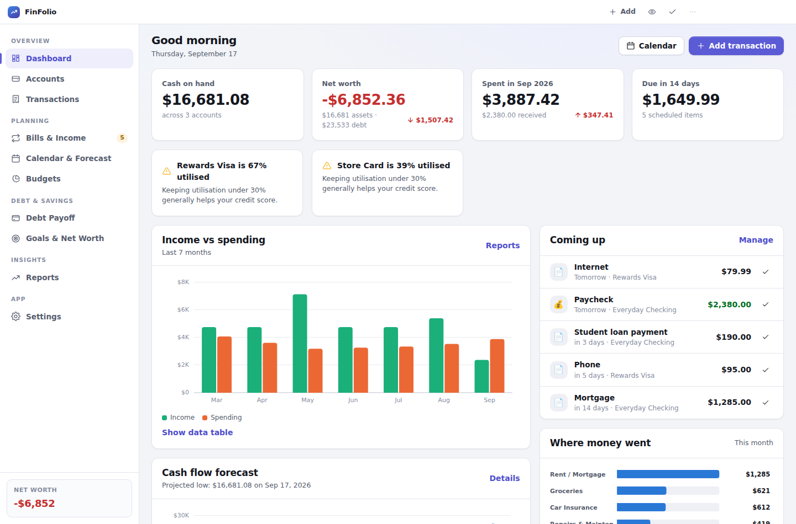
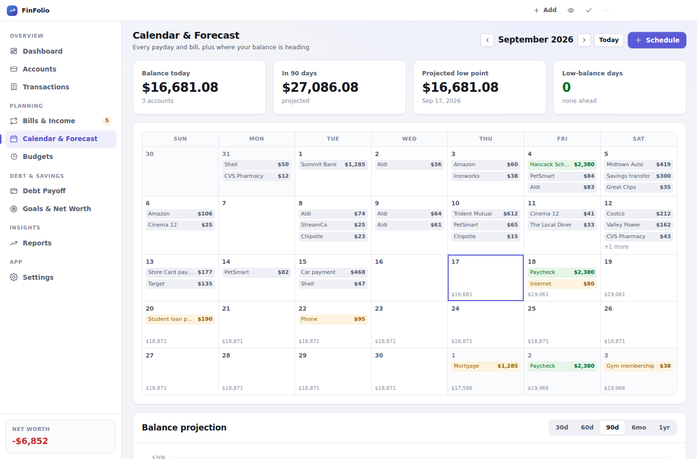
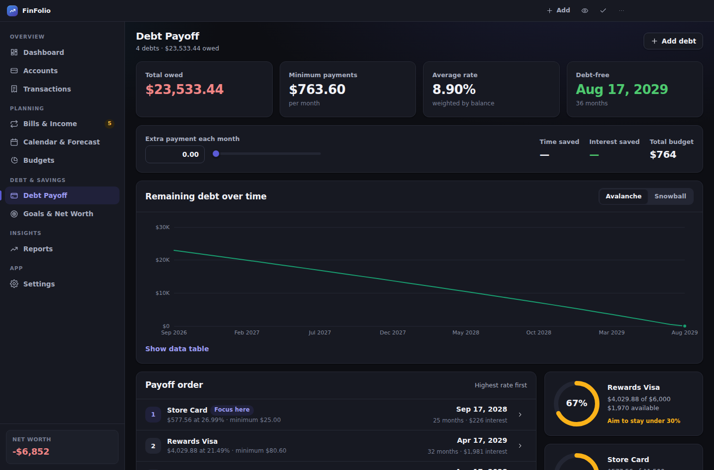
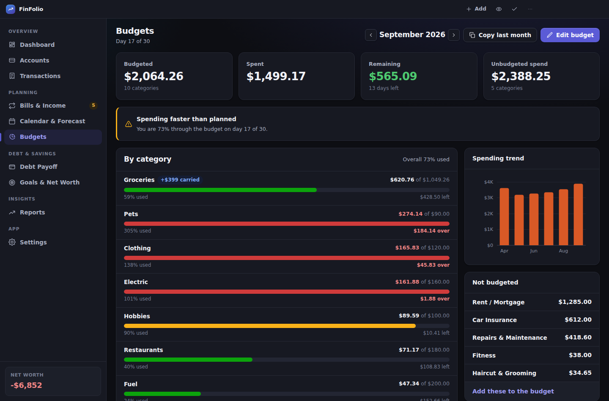
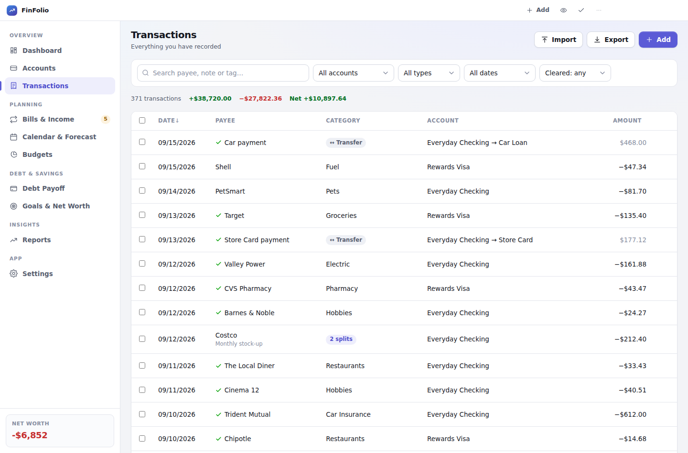

# FinFolio

A private, offline-first personal finance manager for Windows. Accounts, paydays,
bills, recurring charges, transactions, credit cards, loans, budgets, goals and
forecasts — all stored on your own computer, with updates delivered automatically
from GitHub.



---

## What it does

**Money in and out**

- **Accounts** — checking, savings, cash, investments, credit cards, mortgages, student loans,
  other loans and debts. Balances are calculated from a starting balance plus every transaction,
  so they always reconcile. Cards show how much credit is left in dollars as well as percent,
  with a running total across every card. Sort the tiles by type, name or balance, or put
  them in an order of your own.
- **Transactions** — income, expenses and transfers, with categories, payees, notes, tags,
  cleared/uncleared status and multi-category splits. Fast register view with running balance,
  sorting, filtering by account, type, cleared state and any date range you like, bulk edit
  and search.
- **Categories and sub-categories** — put Pet food, Vet bills and Toys under Pets. Spending
  rolls up to the parent everywhere it is totalled, and a sub-category can carry its own
  budget that is carved out of the parent's rather than stacked on top.
- **Bills, paydays & subscriptions** — one schedule per recurring item. Weekly, every two or
  four weeks, twice a month, monthly, quarterly, half-yearly, yearly or one-off, with optional
  "move off weekends" handling and autopay flags. One click records a scheduled item into the ledger.
  Lists are separated into credit cards, loans, subscriptions and everyday bills, and each row
  wears its category's icon (or one you pick for it).
- **Subscriptions, and what dropping them is worth** — a tab of everything you subscribe to,
  dearest first, with the monthly *and* annual cost and what share of your income it all eats.
  Tick the ones you could live without to see the yearly saving, then pause them in one go.
- **Credit card and loan payments are bills too** — each card or loan can put its payment on
  the calendar with an amount that *follows the balance*, so the minimum is never stale. Pick
  the minimum, the full balance, or a fixed figure; when you record it, one tap fills in the
  minimum or the payoff amount.
- **Mortgages, properly** — a mortgage payment is escrow plus interest plus a little
  principal, and FinFolio records it that way. The escrow goes to taxes and insurance, the
  interest is charged to the loan, and only the principal comes off the balance — so your
  balance tracks the lender's instead of drifting optimistic by the interest every month.
  The same split applies to car loans and any other amortising debt.
- **Loans that get forgiven** — for Public Service Loan Forgiveness and similar, count
  qualifying payments instead of dollars. Tell it how many you had already made, and it
  tracks the rest, projects the forgiveness date, and keeps the payoff planner from throwing
  extra money at a balance that is going to be written off.
- **Skip one payment** — for the holiday "skip a pay" lenders offer, or a month you have
  already paid ahead. It takes out that one date and leaves the rest of the schedule alone.
  For a loan it offers to add the interest that still accrues, and any fee, so the balance
  and the payoff date stay honest rather than quietly optimistic.
- **Set the amount for one date** — a payday that varies, a quarterly bill that came in high.
  The figure attaches to that occurrence, so the forecast is right about the month in hand
  without rewriting what the schedule is worth on average.

**Planning**

- **This month** — the default view in Bills & Income: how many bills are left to pay and
  what they come to, income still to come, what is already paid, and where your spendable
  balance lands at month end. Step back and forward through the months.
- **Calendar & forecast** — a month calendar of every payday and bill, with your projected
  balance on each day and a 30/60/90-day, 6-month or 1-year balance projection. Days that dip
  below your low-balance threshold are flagged before they happen. Choose which accounts the
  projection counts — **Checking only** is one click, so savings you are not planning to
  spend stops propping the forecast up. Click any day to see what is on it, and any row to
  open it.
- **Budgets** — monthly amounts per category, with optional rollover of anything unspent,
  pace warnings, an "unbudgeted spending" list, and a one-click budget built from your own
  three-month averages.
- **Debt payoff** — snowball vs avalanche side by side, an extra-payment slider showing the
  months and interest it saves, per-debt payoff dates, credit-card utilisation meters and full
  amortisation schedules. Choose which debts the plan is about: set a mortgage or a
  soon-to-be-forgiven loan aside and focus on the cards, without pretending those debts have
  gone away.
- **Goals & net worth** — savings goals with targets, dates and progress, plus a net worth
  trend rebuilt from your actual ledger history.

**Getting data in and out**

- **Import** — CSV, OFX, QFX and QIF from any bank. Column mapping is auto-detected,
  duplicates are found and skipped, and auto-categorisation rules run before you confirm.
- **Reports you can dig into** — any preset range or your own from/to dates, narrowed to one
  account when you want it, and clicking a month, category or payee opens its transactions
  with the average per month, next month's projection from the trend, and a breakdown into
  sub-categories.
- **Export** — transactions, accounts and monthly summaries as CSV. Print any report.
- **Backup & restore** — automatic daily backups plus an exportable `.finbak` file containing
  everything. Reinstalling is: install, restore, done.
- **Several computers, one set of books** — keep the data file in OneDrive, Dropbox or Google
  Drive and every computer shares it. FinFolio watches the file, never overwrites a newer
  version, and merges record by record when two machines have both made changes. No cloud
  folder? Export a backup and import it with **Merge** instead.

**Everything else**

- Light and dark themes (dark is its own palette, not an inverted one), seven accent colours,
  comfortable/compact density.
- Privacy mode blurs every amount until you hover — useful when sharing a screen.
- Optional AES-256 encryption with a password.
- Automatic updates from GitHub Releases.
- Full keyboard control: <kbd>Ctrl</kbd>+<kbd>N</kbd> new transaction, <kbd>Ctrl</kbd>+<kbd>1…9</kbd>
  to jump between screens, <kbd>Ctrl</kbd>+<kbd>F</kbd> search, <kbd>Ctrl</kbd>+<kbd>Z</kbd> undo.
  Press <kbd>F1</kbd> in the app for the full list.

---

## Quick start (building it yourself)

1. **Install Node.js** — the LTS version from <https://nodejs.org>. Take the default options.
2. **Download this project** and unzip it somewhere convenient.
3. **Double-click `Build FinFolio (GUI).bat`** — a window opens, checks the prerequisites,
   and builds the installer when you press the button.
   *(Prefer a plain script? Double-click `build.bat` instead — it does the same thing in a
   console window.)*
4. The installer appears in the **`dist`** folder as `FinFolio-Setup-1.0.0.exe`.
   Run it to install, or copy it to any other Windows PC.

`dist` also contains `FinFolio-Portable-1.0.0.exe`, which runs without installing —
handy for a USB stick.

### Running from source while you tinker

```bash
npm install     # once
npm start       # launch the app
npm run dev     # launch with developer tools open
npm run verify  # syntax check + unit tests (no extra tools needed)
```

Deeper test runs need Playwright, which is not a project dependency —
install it only if you want them: `npm i -D playwright`

```bash
npm run smoke          # render every screen in a headless browser, screenshots in scripts/.smoke
npm run e2e            # drive the real Electron app: setup, saving, encryption, unlock, syncing
npm run e2e:packaged   # same, but against the built app.asar (run electron-builder --dir first)
npm run test:build-window   # the build window's logic, without opening a window
```

| | |
|---|---|
|  |  |
|  |  |

---

## Publishing updates to yourself and anyone else

FinFolio checks `github.com/Sbreland18/finfolio` for new releases on launch and every six
hours. When one exists it offers to download and install it.

### One-time setup

1. Create a **public** repository called `finfolio` under your GitHub account (`Sbreland18`).
2. Push this project to it:

   ```bash
   git init
   git add .
   git commit -m "FinFolio 1.0.0"
   git branch -M main
   git remote add origin https://github.com/Sbreland18/finfolio.git
   git push -u origin main
   ```

If you name the repository something else, change `owner`/`repo` in `electron-builder.yml`
and the links in `src/main/menu.js`.

### Shipping a new version

Pick either route — both produce the same result.

**From the build window** — tick *Publish to GitHub Releases*, paste a personal access token
with `repo` permission, press *Build the installer*.

**From GitHub Actions (recommended)** — tag the commit and let GitHub do the build:

```bash
npm version patch     # 1.0.0 -> 1.0.1  (use "minor" or "major" for bigger changes)
git push --follow-tags
```

`.github/workflows/release.yml` builds on a Windows runner, runs the tests, and publishes
the installer plus the `latest.yml` update feed to a GitHub Release. Existing installs pick
it up within hours.

> The version number is the only thing that matters to the updater. Users are offered an
> update when the published version is higher than theirs.

### About the SmartScreen warning

Windows warns about installers from unknown publishers until they are code-signed.
Click **More info → Run anyway** to install. To remove the warning permanently, buy a code
signing certificate and add `CSC_LINK` and `CSC_KEY_PASSWORD` as repository secrets — the
workflow picks them up automatically.

---

## Your data

| | |
|---|---|
| **Where it lives** | `%APPDATA%\FinFolio\data.json` |
| **Automatic backups** | `%APPDATA%\FinFolio\backups\` |
| **Format** | One JSON document — or AES-256-GCM encrypted, if you set a password |

Settings → Data & storage has a button that opens the folder.

Nothing is ever uploaded. The only network request FinFolio makes is checking GitHub for a
new version.

### Backing up

- **Automatic** — a backup is written the first time you open FinFolio each day and again when
  you quit. The most recent 20 are kept (configurable).
- **Manual** — Settings → Backup → *Export a backup file* writes a single `.finbak` file
  containing accounts, transactions, schedules, budgets, goals and settings. Keep a copy
  somewhere other than this computer.

### Restoring after a reinstall

Install FinFolio, open it, then **Settings → Backup → Restore from a file** and pick your
`.finbak`. Everything comes back exactly as it was. A safety snapshot of whatever was there
before is saved first, so an accidental restore is recoverable.

### If you set a password

There is no recovery. The password never leaves your computer and is not stored anywhere —
it only exists as the key that decrypts the file. Write it down somewhere safe, and keep at
least one backup you can still open.

---

## Using it on more than one computer

There is no FinFolio server and nothing is uploaded. Syncing works by putting the data file
somewhere that is already synced, and by FinFolio behaving correctly when the file changes
underneath it.

### The automatic way — a synced folder

1. On the **first** computer: **Settings → Sync across computers → Choose a folder…** and pick
   a folder inside OneDrive, Dropbox, Google Drive or a network share. FinFolio detects the
   usual cloud folders and offers them as one-click buttons. Your data moves there; the old
   copy is left behind renamed, not deleted.
2. On **every other** computer: install FinFolio, open it, go to the same setting, pick the
   **same folder**, and choose **“Use the data there”** when it asks.

From then on all of them read and write one file.

**What happens when two computers both make changes.** FinFolio checks the file every few
seconds. If another computer has written a newer version, you are asked what to keep rather
than one side quietly winning:

| Choice | What it does |
|---|---|
| **Merge both** (recommended) | Keeps everything: records only one computer has are added, records both changed keep the newer edit, and anything deleted stays deleted. |
| **Keep mine** | This computer's version wins. |
| **Use the other version** | Reloads the shared file and discards this computer's unsaved changes. |

A save is never allowed to silently overwrite a newer file, so the worst case is being asked
a question — not losing an afternoon's entries.

> Cloud folders sync *files*, not live edits. It all works with two machines open at once,
> but closing FinFolio when you finish on a computer keeps things simplest — and avoids the
> cloud client's own "conflicted copy" files.

### Cloud copies of your backups

Separate from syncing the live file, and useful on its own: **Settings → Backup & restore →
Keep a copy in the cloud**. Pick a folder your cloud app already syncs and every automatic
backup is copied there as well as kept locally. Losing the computer then costs you nothing.

FinFolio detects the folders that are actually installed rather than guessing at paths:

| Provider | Where it looks |
|---|---|
| OneDrive (personal and work) | The `OneDrive`, `OneDriveCommercial` and `OneDriveConsumer` variables Windows sets, plus any `OneDrive - <Organisation>` folder |
| Google Drive | The virtual drive letter Google Drive for Desktop mounts (`G:\My Drive`), and the older `~\Google Drive` layout |
| Dropbox | `%LOCALAPPDATA%\Dropbox\info.json`, which is correct even if the folder was moved |
| iCloud Drive | `~\iCloudDrive`, and `~/Library/CloudStorage` on macOS |

The chosen folder is created if it does not exist, and FinFolio proves it can write there
before accepting it. Only the backup files are copied — the live data file stays put unless
you also set up folder syncing above. The cloud folder being offline never stops a local
backup; you just get a note that the copy did not happen.

### The manual way — backup files

No cloud folder, or a computer that is rarely online? Export a backup on one, import it on
the other, and choose **Merge** instead of **Replace**. Same merge rules, done by hand.

### What merging does and does not do

- It never loses a record without a reason. Deletions are recorded as tombstones, so a merge
  honours them instead of resurrecting everything you have ever deleted.
- Settings about your finances (currency, date format, forecast window) follow the newer
  copy. Settings about the computer (theme, accent, density, privacy mode) stay local, so
  each machine keeps its own look.
- If you set FinFolio up separately on two computers before connecting them, their default
  categories are matched by name so "Groceries" does not become two categories.
- **Accounts are never combined**, even when two have the same name — two separately created
  "Checking" accounts may hold genuinely different money. If you end up with duplicates,
  archive one.
- If you use a password, every computer needs the same one — the file is encrypted with it.

---

## How it is built

No frameworks, no bundler, no native modules — which is why `npm install` is quick and the
build needs nothing but Node.js.

```
src/
  main/                  Electron main process (Node)
    main.js              app lifecycle, window, app:// protocol
    preload.js           the only bridge to the renderer (context-isolated)
    ipc.js               every IPC channel
    store.js             atomic, crash-safe persistence, relocatable data folder, backups
    merge.js             combining two computers' copies of the document
    crypto.js            AES-256-GCM with a scrypt-derived key
    schema.js            document shape, seed data, migrations
    updater.js           electron-updater against GitHub Releases
    menu.js              application menu and accelerators
  renderer/              the interface (plain ES modules, no framework)
    index.html
    css/                 design tokens, base, components, layout
    js/
      boot.js            unlock gate, first-run setup, bootstrap
      shell.js           title bar, sidebar, router
      state.js           in-memory document, undo, debounced autosave
      sync.js            the multi-computer flows (conflicts, merging, folders)
      finance.js         all financial calculation (pure functions)
      recurrence.js      the recurring-date engine
      charts.js          dependency-free SVG charts
      parsers.js         CSV / OFX / QIF parsing
      views/             one module per screen
scripts/
  check.js               syntax + import + asset checker
  test-core.mjs          58 unit tests for the financial core
  smoke.mjs              renders every screen in Chromium and screenshots it
  build-gui.ps1          the build window
```

A few decisions worth knowing about if you plan to modify it:

- **Balances are signed from your point of view.** Assets are positive, debts negative.
  A card purchase is an expense on the card; paying the card is a transfer from checking.
  This keeps net worth a single sum and makes transfers impossible to double count.
- **Dates are plain `YYYY-MM-DD` strings** treated as local calendar days, never as UTC
  instants — so a bill due on the 1st never slides to the 31st because of a timezone.
- **Recurring dates are computed as `start + n × period`**, not by stepping a cursor, so a
  bill anchored to the 31st lands on the 28th in February and returns to the 31st in March.
- **A scheduled amount can be derived rather than stored.** A card payment's `amountSource`
  points at the card, and `resolveRuleAmount` works out the minimum from the current balance
  wherever the amount is needed — list, calendar, forecast, monthly totals. Nothing has to be
  retyped when the balance moves, and a paid-off card quietly asks for nothing.
- **Saves are atomic**: write to a temp file, fsync, rename over the live file, keeping the
  previous good copy. A power cut mid-save leaves two recoverable versions on disk.
- **A save never overwrites a file it did not load.** The store fingerprints the file on
  read and re-checks before every write; a mismatch returns `CONFLICT` and the interface asks
  what to keep. Deletions are recorded as tombstones so merges do not resurrect them.
- **The renderer never touches Node.** Context isolation is on, node integration is off, and
  `preload.js` exposes a fixed list of calls and nothing else.

### Tests

```bash
npm run verify   # check.js + test-core.mjs
npm run smoke    # every screen rendered in Chromium, both themes, screenshots in scripts/.smoke
```

The unit tests cover balance arithmetic, the recurrence engine (month-end clamping, weekend
shifts, semimonthly), amortisation against the standard annuity formula, the payoff planner,
budget rollover, duplicate detection, statement parsing, encryption round-trips, the store's
atomic-write and corruption-recovery paths, and the whole sync path — merging, tombstones,
conflict refusal, relocating the data folder and a second computer adopting it.

---

## Troubleshooting

**The build fails with a permissions or "file in use" error.**
Close any running copy of FinFolio and try again. If it persists, delete the `node_modules`
folder and re-run the build.

**The app runs but no window appears.**
Open Task Manager, end any `FinFolio` task (a stuck instance holds the single-instance lock
and makes later launches quit silently), then start it again. FinFolio now forces its window
to appear within four seconds no matter what, so this should not recur — and if anything goes
wrong at startup it is written to:

```
%APPDATA%\FinFolio\logs\main.log
```

Paste that path into the Windows Explorer address bar. The log names the failing step.

**The build fails with `Unexpected token '', "{ "name"...`**
Something wrote `package.json` with a byte-order mark — an invisible character at the start
of the file that electron-builder's JSON parser rejects. `npm run check` removes it
automatically, and it runs before every build, so simply building again fixes it.

**"Node.js was not found."**
Install the LTS build from <https://nodejs.org>, then close and reopen the build window —
new installs are not visible to windows that were already open.

**The update never appears.**
The published version must be higher than the installed one, and the GitHub release must not
be a draft. Settings → Updates → *Check now* shows the exact error if there is one.

**I forgot my password.**
There is no way to recover it. Restore from a backup you can still open, or from an
unencrypted export.

**Something looks wrong on one screen.**
`npm run smoke` renders every screen and fails loudly on any error — run it and the failing
screen is named in the output.

**I need to miss one payment, not stop the whole bill.**
Open the ⋯ menu on the row in **Bills & Income** and choose *Skip just <date>*. Deleting the
schedule would take every future payment with it and pausing stops them all until you
remember to resume; a skip removes exactly that one date. Skipped rows stay visible with a
**Put it back** button, and **Settings → nothing** is needed — it syncs to your other
computers like anything else.

**A lender's "skip a pay" — does FinFolio know interest still runs?**
Yes, and it asks. The skip dialog offers to add one month's interest to the loan and to
record the lender's fee, because a skip-a-pay does not pause interest: that is how the offer
pays for itself. Leave both on and the balance and payoff date stay truthful. The
amortisation schedule in **Debt Payoff** shows the skipped month with no payment, the
interest still accruing, and everything after it pushed out.

**I paid it, but Debt Payoff still shows the payment as due.**
Fixed in 1.4.2. A payment recorded from **Bills & Income** was always recognised; one typed
in from the Debt Payoff screen was not, because it had no schedule attached. FinFolio now
counts any transfer into the card or loan within a few days of the due date, as long as it
covers what was due — a small extra payment against the principal deliberately does *not*
clear the real one. The detail dialog also shows **Next payment** and **Last payment
recorded**, so you can see it registered.

**How do I set up a mortgage?**
Add the account with type **Mortgage**. Put the *whole* monthly payment in "Monthly payment"
and the escrow part in "Of that, escrow" — both are on your statement. Add the house itself
as an **Other asset** account if you want net worth to be right. When you record the payment
FinFolio splits it: escrow to taxes and insurance, interest charged to the loan, and only
the principal off the balance. That is why the balance falls so slowly at first, and it is
what your lender is doing too.

**How do I track student loans heading for forgiveness?**
Add each one as a **Student loan**, tick *"This loan will be forgiven after a number of
payments"*, set the count (120 for PSLF), and enter how many qualifying payments you had
already made before FinFolio. Leave "count payments recorded here from" at today so the two
halves don't overlap. Accounts and Debt Payoff then show progress toward forgiveness instead
of a payoff date, and the planner sends spare money to your other debts — paying a
soon-to-be-forgiven balance down early is money you don't get back.

**Can I put sub-categories under a category?**
Yes — Settings → Categories & rules → *Manage categories*, then the **+** on any top-level
category. Nesting is one level deep on purpose. A sub-category always lives in its parent's
group, and its spending counts toward the parent everywhere: reports, the drill-down, and
budgets. Give a sub-category its own budget and that amount is taken out of the parent's
rather than counted twice. Deleting a parent keeps its children and moves them up a level.

**My mortgage is swamping the payoff plan.**
Set it aside. **Debt Payoff → Choose debts** (the button on the Payoff order card) unticks any
debt you don't want in the avalanche or snowball, with one-click sets for *All but the
mortgage*, *Cards and short-term debt*, and *Cards only*. New mortgages start out set aside.
Set-aside debts get their own section on the screen with balances and minimums, keep their
place in Bills & Income, and still count against net worth — and the headline changes from
"Debt-free" to "Plan finishes" so the date never overstates what it means.

**Debt Payoff says I'll be debt-free in 2031, but one card shows 2034.**
Both are right, and 1.4.2 says which is which. The date on the debt's detail dialog is that
debt *on its own* at its current payment. The screen behind it runs your whole snowball or
avalanche plan, where every debt that clears rolls its payment into the next one — which is
much faster. The dialog now labels its own figure "Paid off on its own" and names the plan's
date for that debt beside it.

**I changed a payment date and Debt Payoff still shows the old one.**
Fixed in 1.4.1 — the payoff schedule used to start from the day you opened the screen rather
than from the payment date, so every row landed on today's day of the month. It now follows
the schedule in **Bills & Income** (or the account's due day if there is no schedule), and
the detail dialog states the next payment date at the top so you can see what it used.

**Two computers keep asking me to merge.**
That means both have unsaved changes each time they save. It is safe — merging keeps
everything — but closing FinFolio when you finish on a machine stops it happening.

**My cloud folder made a "conflicted copy" file.**
That is the cloud client, not FinFolio, and it happens when two computers write at the same
moment. FinFolio's own file is still correct. You can import the conflicted copy as a backup
with **Merge** if you think it holds something the live file does not.

---

## Licence

MIT — see `build/license.txt`.
